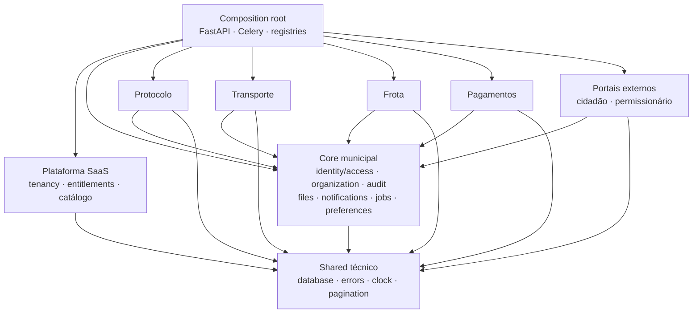

# Arquitetura de monólito modular multi-tenant

**Status:** aprovado para planejamento e execução incremental

**Data:** 2026-08-01

**Base auditada:** `main`, commit `6e368d1` (o código funcional coincide com `e1f2a08`; o commit posterior altera somente `CLAUDE.md`)

**Escopo:** backend, frontend, identidade e acesso, contratação de módulos, dados, jobs e migração física dos fontes

**Documento de execução:** [`../plans/2026-08-01-arquitetura-modular-monolito.md`](../plans/2026-08-01-arquitetura-modular-monolito.md)

## 1. Decisão executiva

O produto evoluirá como um **monólito modular multi-tenant**: um repositório, um backend, um frontend, um banco e um fluxo de deploy, mas com fronteiras explícitas entre plataforma, núcleo municipal e módulos comerciais.

A unidade de contratação será o módulo de negócio. Uma prefeitura poderá contratar Transporte, Frota, Pagamentos, Protocolo ou qualquer combinação entre eles. Tudo o que for indispensável para operar um módulo — autenticação, usuários, perfis, unidades organizacionais mínimas, auditoria, arquivos, notificações e jobs — fará parte do núcleo sempre disponível, e não de uma venda adicional chamada Administração.

O acesso efetivo seguirá esta ordem, sempre no backend:

```text
tenant/RLS
  → entitlement do módulo
    → capability da operação
      → escopo de dados (own | unit | tenant)
        → caso de uso
```

O frontend repetirá essas decisões para navegação e experiência do usuário, mas nunca será a barreira de segurança definitiva.

Para capabilities `core.*`, a etapa de entitlement resolve como **core built-in ativo** e não exige uma linha comercial. Operações `platform.*` usam uma fronteira administrativa separada e não entram no pipeline de autorização municipal.

## 2. Objetivos

- Permitir que um tenant contrate um ou vários módulos sem dependências comerciais artificiais.
- Permitir que uma pessoa acumule papéis diferentes em módulos diferentes.
- Representar perfis como administrador de módulo, secretaria, fiscal, consulta e solicitante sem depender de nomes mágicos de grupo.
- Limitar dados por escopo próprio, unidade ou tenant, além do isolamento já existente por tenant.
- Separar fisicamente os fontes por domínio no backend e no frontend sem um big bang.
- Centralizar a definição de cada módulo em um manifesto e um registry de composição.
- Bloquear um módulo descontratado em HTTP, portal público, workers, beat, CLI, uploads e exports.
- Preservar URLs, contratos HTTP, nomes de tasks Celery, tabelas, schemas e histórico de migrations durante a reorganização.
- Dar ao Claude Code um caminho incremental, verificável e reversível por PR.

## 3. Fora de escopo

- Microserviços, microfrontends ou banco por módulo.
- Deploy independente por módulo nesta transformação.
- Plugins de terceiros carregados dinamicamente em produção.
- Reescrever migrations existentes ou renomear schemas/tabelas como parte da mudança física.
- Mover arquivos existentes no storage durante o refactor.
- Alterar simultaneamente organização física, política de autorização e URLs públicas.
- Tornar o frontend uma fonte de autorização.
- Apagar dados automaticamente na descontratação.

## 4. Evidências e diagnóstico atual

### 4.1 Controles positivos já existentes

- O catálogo `Modulo`, a associação `ModuloTransacao` e a contratação `TenantModulo` já existem em `backend/app/models/modulo.py:8`, `:23` e `:41`.
- `require_modulo` já verifica contratação em `backend/app/auth/modulos.py:28`.
- `require_permission` verifica o módulo antes do bypass de superusuário em `backend/app/auth/perms.py:35-54`.
- O banco já possui contexto de tenant e RLS, além de filtros por tenant na aplicação.
- Frota, Pagamentos e Transporte já possuem schemas SQL próprios.
- O frontend já possui launcher, switcher e menus separados por módulo.

Esses controles serão reaproveitados. A proposta não recomeça o sistema do zero.

### 4.2 Achados priorizados

| ID | Severidade | Confiança | Estado | Achado e evidência principal |
|---|---|---:|---|---|
| F-01 | Crítica | Alta | Confirmado | Administração de plataforma é autorizada por allowlist de e-mail (`backend/app/auth/deps.py:171-183`; `backend/app/config.py:122-126`), enquanto e-mail é único apenas por tenant (`backend/alembic/versions/0005_fix_unique_constraints.py:40-45`). Uma identidade municipal com e-mail coincidente pode alcançar operações cross-tenant. |
| F-02 | Crítica | Alta | Confirmado | Quem tem `usuario.atualizar` pode associar grupos arbitrários (`backend/app/routers/usuarios.py:283-310`); grupos podem receber nível arbitrário (`backend/app/routers/grupos.py:66-93`); `nivel.valor == 0` vira superusuário (`backend/app/services/permissoes.py:90-114`). Há caminho de autoelevação. |
| F-03 | Alta | Alta | Confirmado | Um tenant somente com Transporte não consegue gerir a própria operação: `usuario`, `unidadeTrabalho` e `configuracao` estão ligados a Administração (`backend/app/cli/seed_bootstrap.py:59-72`); grupos, catálogo e criação de usuários dependem dessas transações (`grupos.py:36`, `catalogo.py:56`, `usuarios.py:108`). |
| F-04 | Alta | Alta | Confirmado | A descontratação não cobre todos os canais. Cidadão e catálogo público escapam do gate (`cidadao.py:181`, `:205`, `:263`; `servico.py:102`); tasks de Pagamentos e SLA percorrem tenants ativos sem filtrar módulo (`snapshot_saldos_pagamentos.py:29`; `verificar_sla_workflows.py:221`). |
| F-05 | Alta | Alta | Confirmado | O RBAC legado expressa apenas grupo + transação + flags CRUD (`backend/app/models/grupo.py:7-31`), sem módulo dono, capability de negócio ou escopo próprio/unidade/tenant. Transporte e Frota têm permissões excessivamente amplas. |
| F-06 | Alta | Alta | Confirmado | Rotas diretas do frontend não possuem gate de módulo. O layout apenas deriva módulo do pathname (`frontend/app/(app)/layout.tsx:14-37`) e o middleware só verifica cookie (`frontend/middleware.ts:3-19`). |
| F-07 | Média | Alta | Confirmado | O que hoje é chamado de comum importa negócio concreto. Dashboard backend importa Protocolo/workflow (`backend/app/services/dashboard.py:36`); `/home` e `/dashboard` no frontend executam queries e mostram atalhos de Protocolo (`frontend/app/(app)/home/page.tsx:81-117`, `:140-215`, `:527-552`; `dashboard/page.tsx:82-120`, `:180-205`). |
| F-08 | Média | Alta | Confirmado | Há várias fontes de verdade: migration de catálogo, `MODULO_TRANSACOES`, closures nas rotas, tabelas em testes, agenda Celery, `ROTA_MODULO`, menus e `PLANO_MODULOS` (`backend/app/config.py:129`). |
| F-09 | Média | Alta | Confirmado | A organização física é acoplada: `backend/app/main.py:9` e `:79` importam/registram routers manualmente; `frontend/lib/api.ts` concentra todos os domínios e possui mais de uma centena de consumidores de produção. Mover arquivos diretamente quebraria imports e workers. |
| F-10 | Média | Alta | Confirmado | Jobs possuem autorização inconsistente: uma pessoa pode criar um job pelo Protocolo e não conseguir ler o resultado porque a leitura depende de Administração (`backend/app/routers/jobs.py:191`). |
| F-11 | Média | Alta | Confirmado | `AuditLog` não identifica o módulo de origem, enquanto Transporte mantém trilha própria. A investigação cross-module fica fragmentada. |
| F-12 | Crítica | Alta | Confirmado | A aplicação conecta no Postgres como `ged_user`, que é `SUPERUSER` e `BYPASSRLS` (`docker-compose.yml:4`; verificado na sessão real do container: `current_user = ged_user \| superuser = on`). O papel `aprimora_app` (`NOBYPASSRLS`) existe mas é usado apenas pelos testes. **A RLS descrita no invariante 10 como última barreira de isolamento está inerte no runtime**: o isolamento hoje depende inteiramente do filtro aplicacional. Descoberto na inspeção de `SEC-00` e registrado em [ADR-016 §1.7 e §9.1](../../architecture/adr/ADR-016-platform-operator-identity.md). |

**F-12 é anterior ao RBAC v2.** Endereçado pela família `SEC-RLS-00A` (caracterização e inventário, sem mudar runtime) → `SEC-RLS-00B` (papéis mínimos e compatibilidade) → `SEC-RLS-ROLLOUT` (gate operacional). Enquanto F-12 estiver aberto, o invariante 10 é aspiracional e não deve ser citado como controle vigente em nenhuma análise de risco. `RBAC-01` e qualquer rollout de módulo dependem da conclusão da família.

**A contenção de F-12 não começa trocando a credencial.** O runtime opera com bypass há tempo suficiente para que caminhos hoje funcionais dependam dele sem registro. Trocar a URL de conexão antes do inventário converte um achado de segurança conhecido em incidente de disponibilidade desconhecido. Corrigir policy ou grant que falhar é a única resposta aceita; restaurar `BYPASSRLS` como atalho é proibido.

### 4.3 Limitações desta avaliação

- A avaliação é estática e baseada no commit indicado; integrações externas e cargas reais não foram exercitadas.
- As matrizes definitivas de capabilities exigem validação dos responsáveis de negócio de cada módulo.
- A política de leitura histórica após descontratação precisa ser definida por módulo conforme obrigação legal e contrato.
- O mecanismo definitivo de identidade da equipe de plataforma pode futuramente usar um IdP separado. A contenção imediata definida aqui não depende dessa migração.

## 5. Vocabulário arquitetural

- **Plataforma SaaS:** capacidades operadas pelo fornecedor e com alcance cross-tenant, como catálogo comercial e contratação.
- **Core municipal:** capacidades obrigatórias para qualquer tenant operar, como login, usuários e organização mínima.
- **Módulo comercial:** domínio de negócio contratado separadamente.
- **Entitlement:** direito do tenant de executar um módulo em determinado estado e vigência.
- **Capability:** ação de negócio atômica autorizável, por exemplo `transporte.alvara.emitir`.
- **Papel:** conjunto nomeado de capabilities dentro de um tenant e, normalmente, de um módulo.
- **Template de papel:** modelo versionado fornecido pelo produto e clonável/customizável pelo tenant.
- **Escopo:** limite dos registros alcançáveis por uma atribuição: `own`, `unit` ou `tenant`.
- **Manifesto:** descrição estática do módulo usada pela composição da aplicação.
- **Registry:** catálogo em memória construído pela composição a partir dos manifestos.
- **Portal:** superfície de identidade distinta do quadro interno, como cidadão ou permissionário externo.

## 6. Invariantes obrigatórios

1. Todo dado e toda operação pertencem a exatamente um tenant, à plataforma global ou a uma superfície pública explicitamente classificada.
2. Todo endpoint, task, comando CLI, upload e export pertence a um módulo comercial ou a uma allowlist explícita de core/plataforma.
3. Um módulo não pode ser executado sem entitlement ativo, nem mesmo por superusuário do tenant.
4. A ausência de uma regra de acesso é negação, não permissão implícita.
5. Papéis nunca substituem capabilities no código. Não haverá condicionais como `if role == "secretaria"`.
6. Um usuário pode acumular atribuições em vários módulos.
7. Administrar identidades não concede automaticamente leitura de dados de negócio.
8. Administrador de módulo não é administrador do tenant e nunca é administrador da plataforma.
9. Escopo é aplicado na construção da consulta; não basta filtrar o resultado depois.
10. RLS continua sendo a última barreira de isolamento de tenant. O scope complementa, não substitui, a RLS. **Hoje este invariante não vigora** — ver **F-12**: o runtime conecta com `BYPASSRLS`. Ele só volta a ser um controle real ao fim de `SEC-RLS-ROLLOUT`.
11. O backend é autoridade de acesso. O frontend usa o mesmo vocabulário para UX.
12. Descontratação não remove dados automaticamente.
13. Plataforma não importa modelos concretos de módulos comerciais.
14. Um módulo comercial não importa internals de outro módulo comercial.
15. A reorganização de Python/TypeScript não renomeia recursos persistidos.

Durante `legacy_safe`, os testes atuais de fail-open para transação sem owner e leitura sem permissão permanecem como caracterização. A invariável fail-closed passa a valer para o registry/RBAC v2 somente após matriz aprovada, cobertura completa da superfície e cutover por tenant+módulo. Este documento é a aprovação arquitetural para essa mudança futura de política; ela não deve ser antecipada em PR de movimento físico.

## 7. Contextos e dependências



O grafo não possui setas entre módulos comerciais. Integrações legítimas passam por contratos públicos da plataforma/core ou por eventos internos registrados na composição. Uma FK direta entre módulos de negócio exige ADR específico.

## 8. Catálogo de produto

### 8.1 Plataforma SaaS

- tenant e ciclo de vida comercial;
- catálogo de módulos;
- entitlement, vigência, suspensão e provisionamento;
- identidade e operações exclusivas da equipe do fornecedor;
- observabilidade cross-tenant estritamente privilegiada.

### 8.2 Core municipal sempre disponível

- autenticação e sessão;
- conta própria;
- usuários internos;
- papéis, atribuições e capabilities;
- unidades/lotação e organograma mínimo;
- preferências e branding essenciais;
- auditoria básica;
- notificações;
- arquivos e metadados de storage;
- jobs e downloads gerados;
- infraestrutura de integração;
- consulta dos módulos contratados.

O core pode ter limites comerciais de volume, mas não é um módulo que o tenant precise contratar para usar outro módulo.

### 8.3 Módulos comerciais iniciais

| Slug | Domínio | Dependências comerciais |
|---|---|---|
| `protocolo` | serviços, processos, tramitação, workflow, temporalidade e portal cidadão associado | nenhuma; usa core |
| `transporte` | permissionários, empresas, veículos regulados, vistorias, alvarás e relatórios | nenhuma; usa core |
| `frota` | veículos e operação da frota pública | nenhuma; usa core |
| `pagamentos` | cadastros, caixa, débitos, autorização e relatórios financeiros | nenhuma; usa core |

`administracao`, em sua forma atual, deixa de ser contratação. Se surgir um produto de Administração avançada, ele deverá ter casos de uso próprios e não poderá conter IAM básico.

Transição do catálogo legado:

- criar o owner canônico `core`, ativo e não contratável;
- remapear transações essenciais hoje em `administracao` e `comum` para `core` por aliases compatíveis;
- marcar `administracao` como legado/não contratável e retirá-lo do launcher e da oferta comercial;
- preservar vínculos `TenantModulo` antigos de Administração como histórico inerte, sem usá-los para autorização;
- classificar o dashboard atual como Protocolo; `comum` deixa de ser um balde para negócio concreto;
- remover aliases/fachadas somente em `CONTRACT-03` e registros ou colunas obsoletos somente em `CONTRACT-04`.

### 8.4 Portais e identidades externas

- Cidadão e permissionário externo não são papéis do quadro interno.
- Cada portal deve declarar o módulo proprietário e o tipo de identidade aceito.
- `portals/cidadao` contém apenas realm, sessão, layout e cliente do ator externo; screens e casos de uso do protocolo público pertencem a `modules/protocolo/portal_cidadao` e são ligados pela composition.
- Um solicitante interno pode usar scope `own`; isso não o transforma em cidadão ou permissionário.
- A decisão de unificar provedores de identidade no futuro não altera a separação de atores no domínio.

## 9. Modelo de acesso

### 9.1 Ordem de decisão

Para uma operação autenticada, o autorizador recebe `actor`, `tenant`, `module`, `capability`, `resource` e `requested_scope`:

1. valida a identidade e o tenant ativo;
2. instala e valida o contexto RLS;
3. valida entitlement e estado operacional do módulo;
4. calcula capabilities efetivas das atribuições ativas;
5. compõe a união normalizada dos grants de scope aplicáveis à capability;
6. aplica a união desses predicados à consulta ou valida o recurso carregado;
7. executa o caso de uso e registra auditoria.

O resultado padrão é `deny`.

### 9.2 Capabilities

Formato obrigatório:

```text
<modulo>.<recurso>.<acao>
```

Exemplos:

```text
core.user.create
core.role.assign
transporte.permissionario.read
transporte.vistoria.perform
transporte.alvara.issue
transporte.report.export
```

Regras:

- usar linguagem do negócio, não verbos HTTP;
- leitura é explícita;
- administração/configuração é separada de operação;
- concessão de acesso privilegiado usa capabilities próprias;
- uma capability tem um único módulo dono;
- capabilities removidas são depreciadas antes de serem apagadas.

### 9.3 Scopes

| Scope | Significado | Requisito de implementação |
|---|---|---|
| `own` | recursos criados, requeridos ou explicitamente vinculados ao ator | predicado de propriedade documentado por recurso |
| `unit` | recursos pertencentes às unidades abrangidas pela atribuição | IDs de unidade resolvidos no backend; sem confiar em parâmetro do cliente |
| `tenant` | todos os recursos do tenant permitidos pela capability | RLS continua obrigatória |

Um recurso que não suporta determinado scope deve rejeitá-lo na matriz de capabilities. Não existe promoção automática de `own` para `unit`, e os scopes não formam uma ordem total genérica. Se uma pessoa recebe `own` e duas unidades, o predicado efetivo é `own OR unit IN (...)`; `tenant` só subsume os demais quando essa relação estiver declarada para a capability. O motor nunca escolhe simplesmente o “maior scope”.

### 9.4 Entidades RBAC v2

As tabelas são aditivas e ficam no schema `aprimora_py`. O namespace `core` é representado no catálogo como proprietário não contratável (`contratavel = false`), resolve como built-in e nunca recebe entitlement comercial:

```text
capability
  id, code, module_id, external_module_slug, description, privileged, active

role_template
  id, code, module_id, version, name, system_managed, active

role_template_capability
  role_template_id, capability_id

role_template_capability_scope
  role_template_id, capability_id, scope_type

tenant_role
  id, tenant_id, module_id, template_id?, template_version?, name,
  system_managed, privileged, active

tenant_role_capability
  tenant_role_id, capability_id

tenant_role_capability_scope
  tenant_role_id, capability_id, scope_type

user_role_assignment
  id, tenant_id, user_id, tenant_role_id, scope_type,
  valid_from?, valid_until?, granted_by, revoked_by?, revoked_at?,
  grant_reason, version, created_at

user_role_assignment_unit
  assignment_id, unit_id

role_delegation_rule
  id, tenant_id, grantor_role_id, delegable_role_id, scope_type, active

role_delegation_rule_unit
  delegation_rule_id, unit_id

module_authorization_state
  tenant_id, module_id, mode, first_cutover_at,
  v2_ceiling_enforced_at, version, updated_at

access_revision
  tenant_id, revision, updated_at

access_state_outbox
  id, tenant_id, revision, event_type, payload, occurred_at,
  published_at?, attempts

global_access_revision
  singleton_id, revision, updated_at
```

Restrições mínimas:

- códigos globais únicos para capabilities e templates; internamente a capability referencia `module_id` por FK e expõe o slug estável nos contratos;
- papel e capability com o mesmo `module_id`; o slug é a chave estável exposta nas APIs/manifestos;
- usuário, papel e scope pertencentes ao mesmo tenant por FKs compostas ou validação equivalente garantida no banco;
- unit scope usa tabela associativa com FK real para unidade; não usa `scope_id` polimórfico sem integridade;
- atribuições revogadas preservadas para auditoria;
- `valid_until > valid_from`, timestamps UTC e unicidade parcial para uma atribuição ativa equivalente;
- tabelas tenant-owned usam RLS e grants mínimos; catálogos globais são somente leitura para fluxos municipais;
- unit scope exige ao menos uma unidade do mesmo tenant; scopes `own` e `tenant` não aceitam associações de unidade;
- templates de sistema são imutáveis por versão; atualização cria nova versão e nunca altera silenciosamente papéis tenant já materializados;
- upgrade de template exige preview, aprovação e auditoria;
- os nomes de papéis são apresentação, não identidade de autorização.

`access_revision` é uma linha durável por tenant, incrementada na mesma transação da mudança de acesso. Quando a publicação externa não couber nessa transação, `access_state_outbox` registra o mesmo número de revisão para entrega idempotente. Alterações globais de catálogo, manifesto projetado, capability ou template incrementam `global_access_revision`; nenhum cache depende somente de evento best-effort.

### 9.5 Papéis iniciais de Transporte

Os nomes abaixo são templates, não condicionais de código:

- Administrador do módulo: configuração e todas as capabilities operacionais de Transporte, com scope tenant.
- Secretaria/Gestor: cadastros, análise, vistorias, emissão e relatórios conforme matriz aprovada.
- Fiscal/Vistoriador: inspeção, evidências e consulta necessária, sem gestão de acesso.
- Consulta/Auditoria: leitura e trilhas, sem mutação.
- Solicitante interno: criação e acompanhamento apenas dentro do scope próprio definido por recurso.

A matriz completa é uma entrega anterior à ativação do RBAC v2 em Transporte.

### 9.6 Autoridade de concessão

Capabilities administrativas distintas:

```text
core.user.manage
core.role.manage
core.role.assign
core.role.grant_privileged
```

Política obrigatória:

- a autoridade de concessão é uma relação explícita entre papéis do concedente e papéis delegáveis, incluindo tipos de scope e unidades permitidas; ela não é inferida somente das capabilities efetivas do ator;
- possuir `core.role.assign` permite executar o fluxo, mas não torna essa capability nem qualquer papel automaticamente delegável;
- antes de conceder ou editar um papel, o backend valida cada capability, cada scope e todos os assignments afetados contra as regras de delegação;
- ninguém concede a si próprio uma elevação;
- ninguém concede scope mais amplo ou unidades fora de sua autoridade;
- capabilities de administração, delegação e concessão privilegiada não são autodelegáveis;
- papéis privilegiados não podem ser editados por administradores comuns;
- papéis privilegiados seguem fluxo de aprovação auditado e o último tenant owner ativo não pode ser removido sem substituto válido;
- alteração de papel, capability, atribuição ou scope gera auditoria;
- revoke registra `revoked_by` e motivo;
- administrador de tenant gerencia identidades, mas não lê automaticamente dados dos módulos;
- administrar um módulo exige atribuição explícita nesse módulo;
- superusuário legado não contorna entitlement enquanto existir.

### 9.7 Identidade de administrador da plataforma

O e-mail e qualquer identidade pertencente a tenant deixam de ser credenciais de autorização cross-tenant.

Regra obrigatória:

- a identidade de plataforma pertence a um namespace de segurança separado e usa `(issuer, subject)` de IdP administrativo ou um `platform_principal.id` dedicado;
- é proibido vinculá-la a `utils.usuario.id`, e-mail ou outro cadastro municipal;
- rotas de plataforma exigem issuer/audience/realm próprios e rejeitam categoricamente tokens emitidos para APIs municipais;
- a UI de operador usa árvore de sessão, cookie/armazenamento, cliente HTTP e query cache separados do staff municipal;
- endpoints municipais nunca criam, alteram ou concedem um principal de plataforma;
- rotas SaaS não reutilizam `require_tenant_id`/sessão RLS municipal: recebem o tenant alvo explicitamente, usam transação/role de plataforma e auditam operador + tenant alvo;
- concessão/revogação ocorre somente por fluxo operacional restrito, com MFA, motivo e auditoria;
- subjects colidentes entre issuers diferentes não são a mesma identidade.

### 9.8 Service principals

Automação interna possui identidade explícita. `requested_by = null`, nome de task ou posse da fila nunca são autorização.

```text
service_principal
  id, code, owner_module_id, active, valid_from, valid_until,
  created_at, revoked_at, revoked_by, reason, version

service_principal_capability
  service_principal_id, capability_id, allowed_scope_type

task_execution_policy
  task_name, owner_module_id, service_principal_id, capability_id,
  access_mode, active
```

O registry declara a política `task → owner → principal → capability`; o banco controla lifecycle/revogação e o startup valida paridade. Tasks disparadas por usuário preservam `requested_by` e revalidam esse ator. Tasks agendadas usam o service principal registrado, com menor privilégio, vigência, auditoria e rotação. Credenciais, quando existirem, nunca seguem no payload da fila.

A implantação respeita a ordem das dependências. Antes de o catálogo RBAC v2 existir, a expansão persiste `operation_code` estável e o owner já materializado, sem inventar `capability_id`. Depois da criação e do backfill validado do catálogo, uma migration aditiva resolve o código, adiciona a FK de capability e só então endurece a coluna; código e FK não são duas fontes de autorização concorrentes.

## 10. Entitlement e ciclo de vida do módulo

### 10.1 Fonte única

O conceito de domínio será `tenant module entitlement`, mas a tabela física existente `aprimora_py.tenant_modulo` será expandida e permanecerá como a única autoridade operacional. Não será criada uma segunda tabela concorrente. Plano comercial pode explicar como o entitlement foi adquirido, mas nunca calcular acesso em tempo de execução.

Estados alvo:

| Estado | Novas operações | Leitura corrente | Workers | Dados |
|---|---|---|---|---|
| `pending` | bloqueadas | política de implantação | não executam | preservados |
| `active` | permitidas conforme RBAC | permitida conforme RBAC | executam | preservados |
| `suspended` | bloqueadas | política contratual explícita | não iniciam; enfileiradas abortam com motivo | preservados |
| `cancelled` | bloqueadas | somente política histórica aprovada | não executam | preservados |

Campos mínimos no modelo expandido: `tenant_id`, referência ao módulo, `status`, `valid_from`, `valid_until`, `source`, `plan_reference`, `provisioning_state`, `version`, `created_by` e auditoria temporal.

O entitlement efetivo é calculado de forma fechada:

```text
tenant.active
AND module_catalog.active
AND status == active
AND valid_from <= database_utc_now
AND (valid_until IS NULL OR database_utc_now < valid_until)
AND provisioning_state == ready
```

Vigência usa intervalo `[valid_from, valid_until)` e relógio UTC do banco. Transições de estado são enumeradas, usam controle otimista por `version` e hooks idempotentes. Estado desconhecido, provisioning parcial/falho, versão conflitante ou divergência com os booleanos legados resultam em deny e alerta operacional.

O `core` não possui linha de entitlement: ele é provisionado para todo tenant válido e continua protegido por capabilities e scopes. `tenant_modulo` contém somente módulos comerciais contratáveis e seus históricos.

Na fase de compatibilidade, `tenant_modulo.ativo/excluido` permanece como representação legada derivada do novo status na própria linha. Escritas passam por um único serviço e mantêm os campos em paridade até a remoção dos booleanos. A ausência atual de RLS não permanece como confiança implícita: o runtime municipal usa RLS/visão limitada ao tenant e não recebe DML de entitlement; operações cross-tenant/DML usam papel/conexão de plataforma separado, somente após autenticação administrativa; workers possuem grants mínimos próprios. Testes exercitam os papéis reais do banco e impedem que caso de uso municipal leia ou altere entitlement de outro tenant.

### 10.2 Política por canal

| Canal | Regra obrigatória |
|---|---|
| HTTP interno | tenant + entitlement + capability + scope |
| Catálogo público | publicar apenas serviços de módulo ativo |
| Portal cidadão/externo | entitlement na abertura, complementação, upload e novas operações |
| Celery beat | selecionar somente tenants com entitlement ativo |
| Worker | revalidar ator/service principal, entitlement, capability e scopes ao iniciar e antes de publicar o resultado |
| CLI de negócio | exigir tenant explícito e validar entitlement; comandos de core usam allowlist explícita |
| Upload | namespace do módulo + entitlement ativo + capability quando autenticado |
| Export | entitlement ativo + capability + scope |
| Webhook/inbound integration | resolver tenant e módulo antes de persistir ou enfileirar |
| Validação histórica pública | `AccessMode` tipado e registrado, política específica, somente leitura, sem reativar operação |

Os únicos modos de acesso ao lifecycle são `execute`, `historical_read` e `public_validation`, declarados no registry. Um endpoint não escolhe livremente sua classificação. Na ausência de política histórica versionada e aprovada, o padrão é deny.

### 10.3 Ativação e desativação

Cada manifesto pode fornecer hooks idempotentes de `provision` e `deprovision`. Eles configuram defaults e suspendem integrações, mas não criam ou apagam schema.

As transições usam outbox transacional e obedecem à seguinte ordem fechada:

- **ativar:** gravar `pending/provisioning` (ainda deny) e o evento na outbox na mesma transação → após o commit, executar `provision` idempotente → confirmar, na mesma transação final, `active/ready`, nova `version`, nova `access_revision` e o evento correspondente na outbox;
- **suspender:** gravar atomicamente `suspended/deprovisioning`, nova versão/revisão e outbox — o deny é imediato → executar `deprovision` idempotente → concluir `suspended/deprovisioned`;
- **reativar:** mover `suspended/deprovisioned → pending/provisioning` (deny) → executar `provision` → concluir `active/ready`;
- **cancelar:** gravar primeiro `cancelled/deprovisioning`, nova versão/revisão e outbox — o deny é imediato → executar `deprovision` → concluir `cancelled/deprovisioned`;
- **recontratar após cancelamento:** nunca faz `cancelled → active` diretamente; cria uma nova versão contratual explícita, passa por `pending/provisioning` e reprovisiona.

Falha de hook mantém o entitlement em estado não efetivo, com erro auditado e retry idempotente; nenhum caminho marca `active` antes de `ready`. Comandos administrativos de suspender, cancelar ou reativar só são expostos depois que API, worker e beat compatíveis estiverem implantados e o playbook de cada transição tiver sido exercitado.

Descontratar:

- impede novas escritas, jobs, uploads e exports imediatamente;
- impede o beat de gerar trabalho;
- faz workers enfileirados abortarem de forma registrada e não retentável por falta de entitlement;
- invalida o `AccessSnapshot` do frontend;
- preserva dados, auditoria e arquivos;
- mantém apenas leituras históricas formalmente aprovadas para aquele módulo.

## 11. Manifesto e registry

### 11.1 Backend

Contrato conceitual:

```python
ModuleManifest(
    slug="transporte",
    dependencies=(),
    capabilities=(...),
    router_factories=("app.modules.transporte.api:create_router",),
    task_refs=("app.tasks.transporte.run",),
    schedules=(...),
    storage_namespace="transporte",
    provision=...,
    deprovision=...,
    dashboard_providers=(...),
    search_providers=(...),
)
```

O manifesto usa dotted paths ou factories declarativas; somente a composition root os resolve. Importar o manifesto não pode carregar routers, modelos ou tasks, iniciar I/O, conectar banco ou importar toda a aplicação por efeito colateral.

O registry valida no startup/teste:

- slug único;
- capability com dono único;
- dependências conhecidas e sem ciclo;
- rotas e tasks classificadas;
- nomes Celery únicos;
- provider com contrato compatível;
- paridade com catálogo persistido.

### 11.2 Frontend

Contrato conceitual:

```ts
interface ModuleManifest {
  slug: ModuleSlug;
  routes: readonly {
    match: RouteMatcher;
    access: AccessRule;
    landingPriority?: number;
  }[];
  navigation: readonly NavigationGroup[];
  resolveLanding(access: AccessSnapshot): string | null;
  loadHomeContributions?: () => Promise<readonly HomeContribution[]>;
}
```

O manifesto substitui progressivamente `ROTA_MODULO`, `MENUS` e raízes fixas. Metadados permanecem leves; screens e bibliotecas pesadas são lazy.

O catálogo/registry do backend é autoridade sobre entitlement e capabilities. O registry frontend descreve UX. Testes de paridade impedem divergência de slugs, caminhos e capabilities referenciadas.

### 11.3 Hierarquia das fontes de verdade

- manifesto backend: fonte canônica do que o binário implementa — slugs, owners de capabilities, routers, tasks, schedules e providers;
- banco: fonte canônica do estado por tenant — entitlements, papéis, assignments, revisões e auditoria;
- catálogo persistido de módulos/capabilities: projeção versionada dos manifestos, aplicada por migration/seed determinístico, nunca definição concorrente;
- contrato JSON gerado deterministicamente do registry Python: ponte verificável de slugs e capabilities para o TypeScript; o CI regenera e exige diff zero;
- manifesto frontend: metadados e regras de UX que só podem referenciar o contrato gerado;
- `AccessSnapshot`: fonte runtime da UI para o acesso efetivo daquela sessão, sem autoridade sobre o backend.

Todos os routers e tipos de task do binário são registrados globalmente no startup. Manifestos nunca incluem/excluem código por tenant; o entitlement é avaliado em runtime.

## 12. Organização física alvo

### 12.1 Backend

```text
backend/app/
  composition/
    api.py
    celery.py
    module_registry.py

  platform/
    tenancy/
    entitlements/
    operator_identity/

  core/
    identity_access/
    organization/
    audit/
    notifications/
    files/
    jobs/
    integrations/
    preferences/

  modules/
    protocolo/
    pagamentos/
    frota/
    transporte/
      manifest.py
      permissionarios/
      empresas/
      veiculos/
      vistorias/
      alvaras/
      relatorios/

  shared/
    database.py
    errors.py
    clock.py
    pagination.py
```

Regras:

- `composition` conhece plataforma e todos os módulos;
- módulos importam apenas `shared` e APIs públicas de `core`;
- a decisão de acesso do core consome entitlement por uma porta estreita cuja implementação de plataforma é ligada pela composition;
- módulos não importam internals de outros módulos;
- `platform` e `core` não importam modelos de negócio concretos;
- dashboard, busca e notificações recebem contribuições registradas;
- modelos podem continuar apontando para usuários/unidades/tenant do core;
- FK cross-module de negócio exige ADR;
- fachadas/reexports nos paths antigos permanecem durante a migração.

### 12.2 Frontend

```text
frontend/
  app/                         # wrappers finos das rotas Next; URLs preservadas
    (staff)/
      layout.tsx               # sessão, QueryClient e AccessProvider compartilhados
      (launcher)/
      (workspace)/
    (operator)/
      layout.tsx               # realm/token/cache SaaS separados
      platform-admin/
  core/
    auth/
    access/
    http/
    modules/
    query/
    shell/
    tenant-admin/

  modules/
    transporte/
      manifest.ts
      api/
      screens/
      components/
      __tests__/
    frota/
    pagamentos/
    protocolo/

  platform/
    operator-admin/

  portals/
    cidadao/

  shared/
    ui/
    validation/
    formatting/
```

Decisões:

- não mover para `src/` na primeira onda;
- páginas do App Router se tornam wrappers pequenos para screens dos módulos;
- `frontend/lib/api.ts` vira fachada temporária: novos imports ficam proibidos, e os consumidores migram por módulo;
- launcher, workspace e administração municipal compartilham provider/query cache em um ancestral staff; operador SaaS, cidadão e público usam clientes/árvores separados;
- `RouteAccessGate` usa a regra de rota do manifesto e impede montar screen ou iniciar query sem módulo/capability; `ModuleGate` é sua parte de entitlement;
- `CapabilityGate` controla ações/elementos, mas o backend sempre revalida;
- enquanto o gate for client-side, wrappers Server Component não fazem I/O de domínio antes dele; qualquer screen server futura chama `assertRouteAccess()` no servidor antes do fetch;
- `must_change_password` tem precedência sobre snapshot, launcher e gates;
- home, busca, notificações e dashboard usam contribuições apenas dos módulos ativos;
- o dashboard atual é considerado Protocolo até existir um dashboard realmente composto.

## 13. `AccessSnapshot`

Após login e troca de tenant, o frontend obtém uma visão única e versionada:

```ts
interface EffectiveCapability {
  code: string;
  scopes: readonly (
    | { type: "own" }
    | { type: "unit"; ids: readonly string[] }
    | { type: "tenant" }
  )[];
}

interface AccessSnapshot {
  revision: string;
  nextRefreshAt: string;
  actor: { id: string; displayName: string };
  tenant: { id: string; slug: string };
  core: {
    roles: readonly string[];
    capabilities: readonly EffectiveCapability[];
  };
  modules: readonly {
    slug: string;
    status: "active";
    roles: readonly string[];
    capabilities: readonly EffectiveCapability[];
  }[];
}
```

Regras:

- o snapshot contém apenas acesso efetivo, não todos os papéis existentes;
- o snapshot serve exclusivamente à composição da UI; não é credencial nem prova de autorização e nunca substitui uma decisão backend;
- uma revisão monotônica por tenant é atualizada na mesma transação de entitlement, assignment, papel, unidade ou estado do usuário; a entrega assíncrona usa a outbox durável, confiável e idempotente;
- o ETag deriva de `access_revision`, `global_access_revision` e de um hash determinístico do estado efetivo recalculado com o relógio UTC do banco; assim, atingir `valid_from` ou `valid_until` altera a resposta mesmo sem uma escrita concorrente;
- `nextRefreshAt` nunca ultrapassa o primeiro limite temporal futuro relevante de entitlement, principal, papel ou assignment. A UI agenda renovação nesse instante e também usa `If-None-Match`, refetch ao recuperar foco/navegar e polling com staleness máxima de 60 segundos; após mutation administrativa, a sessão invalida localmente o cache;
- um 403 estruturado força refresh imediato: `ENTITLEMENT_INACTIVE` redireciona ao launcher; `CAPABILITY_DENIED` e `SCOPE_DENIED` mostram acesso negado sem expulsar do módulo; `ACCESS_SNAPSHOT_STALE` apenas renova o snapshot;
- launcher mostra interseção entre módulo ativo e capability efetiva;
- `resolveLanding` escolhe a primeira rota realmente permitida;
- slug desconhecido no frontend aparece como versão incompatível, sem fallback silencioso para `/home`;
- logout limpa caches associados a tenant e identidade.

Na normalização de scopes, `tenant` absorve grants inferiores somente quando a capability assim declarar, IDs de unidades são unidos e `own` é preservado quando não estiver comprovadamente coberto. O frontend expõe `grantsFor()` e `canAt()`, não um `scopeFor()` singular.

## 14. Dados e migrations

- Todo schema continua instalado em todos os ambientes do monólito, independentemente da contratação.
- As migrations existentes nunca são reescritas ou reordenadas.
- O Alembic permanece com um único head e migrations manuais.
- Reorganizar módulos Python não altera nomes SQL, schemas, FKs ou constraints existentes.
- RBAC v2 e entitlement evoluem por `expand → backfill/shadow → cutover → contract`.
- entitlement segue a coreografia `expand compatível com N-1 → compatibility build em API/worker/beat → backfill idempotente/paridade → autoridade nova por flag → contract posterior`;
- colunas novas seguem nullable/compatível → backfill observável → validação → `NOT NULL` em PR posterior;
- A migration `contract` só ocorre depois de janela de paridade e evidência de ausência de leitores legados.
- Workflow não muda de schema durante a migração física de Protocolo.
- Paths de storage existentes continuam legíveis por fallback.

Namespace alvo para novos artefatos:

```text
{root}/{tenant_slug}/{module_slug}/attachments/
{root}/{tenant_slug}/{module_slug}/jobs/{job_id}/
{root}/{tenant_slug}/{module_slug}/exports/
```

## 15. Compatibilidade de API, jobs e workers

### 15.1 HTTP

- Paths, métodos, códigos esperados e schemas permanecem estáveis durante a migração física.
- Um snapshot OpenAPI detecta alterações involuntárias.
- Mudança futura para `/m/<slug>` é um PR isolado, com redirects 308, nginx, `next=` no login e preservação de links históricos.

Este documento substitui a decisão D2/F3 de `2026-07-28-modularizacao-launcher-design.md` quanto à obrigatoriedade imediata de `/m/<slug>`: o prefixo passa a ser opcional e só pode ser executado no PR isolado `URL-01`. Route groups do App Router preservam URLs e não criam esse prefixo por si mesmos.

### 15.2 Celery

- nomes explícitos de tasks permanecem estáveis;
- o wrapper no path antigo permanece até superar retenção, ETA/countdown e retry horizon e comprovar filas drenadas;
- path Python, nome lógico, assinatura/payload, serializer, routing key, fila, retry/ack, schedule e semântica do resultado não mudam juntos;
- contexto novo é carregado por `job_id` no banco; kwargs novos só entram depois que nenhum worker N-1 existir;
- a matriz old/new producer × old/new worker × beat é testada durante deploy misto;
- worker revalida ator ativo ou service principal explícito, entitlement, capability e scopes no início e antes de publicar o resultado;
- beat agenda por manifesto, mas seleciona apenas tenants elegíveis;
- ausência de entitlement é término registrado, não erro retentável infinito.

### 15.3 Jobs

Todo job passa a registrar `tenant_id`, `module_slug`, `requested_by` ou `service_principal`, `capability`, `scope_snapshot` e estado. `scope_snapshot` é teto e evidência da solicitação, não autorização duradoura: a execução usa a interseção entre o snapshot e a autorização atual. O worker revalida antes de executar e antes de publicar/entregar o resultado. Tarefas de sistema usam service principals explícitos; `requested_by = null` nunca é bypass. O criador ainda autorizado consegue acompanhar o próprio job segundo a mesma política que permitiu criá-lo; Administração deixa de ser requisito implícito.

## 16. Dashboard, busca, notificações e auditoria

- Core define portas e modelos de contribuição; módulos implementam providers.
- Composition registra providers sem fazer o core importar domínios.
- Dashboard e home carregam somente widgets de módulos ativos e permitidos.
- Busca retorna `module_slug`, tipo, link e capability necessária.
- Notificações carregam `module_slug` e a navegação passa pelo gate central.
- Core valida que cada provider pertence ao módulo declarado, que a capability existe e tem o mesmo owner e que resultados são filtrados no backend antes de chegar ao frontend.
- Auditoria registra `module_slug`, capability, actor, tenant, target, resultado, origem/canal e correlation ID.
- Trilhas de negócio específicas podem continuar existindo, mas apontam para o evento de auditoria comum quando aplicável.

## 17. Observabilidade

Métricas mínimas:

- decisões allow/deny por módulo, capability, scope e canal;
- tentativas de grant negadas e grants privilegiados;
- tasks ignoradas/abortadas por entitlement;
- divergências entre RBAC legado e v2 no modo shadow;
- falhas de paridade entre registry, catálogo e frontend;
- hooks de provisionamento por estado;
- requisições a caminhos legados/fachadas para orientar remoção.

Para performance frontend, cada migração registra bytes JS por rota no build manifest antes/depois, a lista de chunks shared permitidos e a origem de cada chunk. Uma rota de Transporte não pode carregar chunk cujo issuer pertença a outro módulo, e seu JS inicial não pode crescer mais de 5% sobre o baseline aprovado sem justificativa. Recharts, XYFlow, TipTap e PDF usam `next/dynamic` somente quando a medição comprovar benefício; CSS global de biblioteca é movido ao owner ou registrado explicitamente como shared.

Logs nunca incluem dados sensíveis desnecessários. Toda decisão de acesso possui correlation ID e motivo estruturado, sem revelar existência de recurso de outro tenant.

## 18. Estratégia de migração

```text
contenção de segurança
  → inventário e guardas
    → skeleton/registry sem mudança de comportamento
      → entitlement em todos os canais
        → core obrigatório
          → RBAC v2 em shadow sobre `legacy_safe`
            → Transporte piloto
              → demais módulos
                → URLs opcionais
                  → remoção do legado
```

Princípios de execução:

- uma preocupação e, depois, um módulo por PR;
- mudança física, mudança de autorização e mudança de URL não compartilham PR;
- cada PR possui testes de caracterização antes da alteração;
- fachadas e feature flags permitem rollback sem reverter migrations aditivas e sem ampliar acesso;
- cutover ocorre por tenant/módulo, nunca global sem shadow;
- Protocolo migra por último por concentrar portal, workflow, documentos e jobs.

Os modos de autorização são `legacy_safe`, `shadow` e `new`, persistidos e versionados por tenant+módulo. `first_cutover_at` e `v2_ceiling_enforced_at` tornam irreversível o fato de que o módulo já passou por v2. Falha ao ler esse estado nega acesso. `legacy_safe` nunca significa retorno cru ao comportamento antigo: ele exige entitlement canônico efetivo, preserva as proteções de grant de `SEC-02` e, depois de um cutover, aplica as restrições v2 como teto para que rollback não amplie acesso. Em `shadow`, a decisão legado segura continua respondendo, enquanto o avaliador v2 é puro: não grava grants, não provisiona, não altera cache e não produz efeitos de negócio. Divergência `legacy_safe deny / v2 allow` é crítica de segurança; `legacy_safe allow / v2 deny` é aperto de acesso e exige validação funcional antes do corte.

A tabela de estado entra por expand sem ser lida pelo runtime. Um backfill idempotente cria `legacy_safe` para cada tenant+módulo comercial existente e para `core` de cada tenant; novas contratações passam a criar o estado na mesma transação do entitlement. A feature flag de leitura só é ligada após paridade e rollback comprovados. A partir desse instante, ausência, corrupção ou erro de leitura é deny; antes dele, o binário de compatibilidade continua na política caracterizada sem consultar a tabela incompleta.

## 19. Decisões arquiteturais (ADRs)

| ADR | Estado | Decisão | Alternativa rejeitada / trade-off | Reavaliar quando |
|---|---|---|---|---|
| ADR-001 | Aceita | Monólito modular | Microserviços agora aumentariam deploy, consistência e observabilidade sem fronteiras maduras | um módulo exigir escala/deploy/SLO realmente independente |
| ADR-002 | Aceita | Core municipal sempre disponível | Vender Administração como pré-requisito torna todo módulo comercialmente dependente | existir Administração avançada com casos de uso próprios |
| ADR-003 | Aceita | Entitlement separado de RBAC | Misturar contratação com papel dificulta suspensão e auditoria | não previsto |
| ADR-004 | Aceita | Capabilities de negócio + scope | CRUD por transação é simples, mas não expressa perfis reais | não previsto |
| ADR-005 | Aceita | Papéis são templates/customizações por tenant | Grupos fixos impedem variações municipais | quando houver delegação federada externa |
| ADR-006 | Aceita | Usuário pode ter múltiplos papéis/módulos | Um papel global cria privilégios acidentais | não previsto |
| ADR-007 | Aceita | Tenant admin não lê negócio automaticamente | Superadmin universal é conveniente, mas viola menor privilégio | break-glass formal e auditado, se necessário |
| ADR-008 | Aceita | Registry + manifestos na composition root | Mapas espalhados já divergiram | se o produto adotar plugins carregáveis externamente |
| ADR-009 | Aceita | Schemas sempre instalados; entitlement controla execução | Migrations condicionais por contrato tornam ambientes irreproduzíveis | se módulos virarem serviços/bancos separados |
| ADR-010 | Aceita | Descontratação preserva dados e bloqueia novas operações | Exclusão automática é irreversível e juridicamente arriscada | política de retenção aprovada por módulo |
| ADR-011 | Aceita | Compatibilidade por fachadas e migração vertical | Big bang de imports quebra APIs, workers e trabalho em paralelo | não previsto |
| ADR-012 | Aceita | Frontend modular dentro do mesmo Next.js | Microfrontends adicionam runtime e coordenação | equipes/deploys independentes justificarem |
| ADR-013 | Aceita | URLs estáveis durante refactor | Alterar URL junto impede isolar regressões | depois dos gates/manifestos estáveis |
| ADR-014 | Aceita | Identidade de plataforma usa namespace, issuer e audience separados | Allowlist, ID ou token municipal não separam o plano SaaS do tenant | ao trocar o IdP administrativo, preservando a fronteira |
| ADR-015 | Aceita | Cidadão/permissionário são identidades externas, não roles internas | Um único tipo de usuário confunde propriedade e grants | ao definir federação de identidade, mantendo atores distintos |

## 20. Critérios de aceite sistêmicos

1. Um tenant com apenas Transporte consegue autenticar, gerir usuários/papéis do core e operar Transporte.
2. O mesmo tenant não invoca Protocolo, Frota ou Pagamentos por API, URL direta, portal público, catálogo, task/beat, worker enfileirado, CLI, upload ou export.
3. Descontratação bloqueia novas operações e preserva dados; a política histórica aprovada é testada.
4. Um usuário acumula papéis distintos em múltiplos módulos.
5. Administrador de Transporte não vira administrador do tenant nem da plataforma.
6. Solicitante acessa somente recursos próprios; secretaria somente unidades atribuídas; administrador de módulo somente o tenant.
7. Não há autoelevação, concessão acima da autoridade, colisão de e-mail nem token/sessão municipal aceito pela plataforma SaaS.
8. Toda superfície executável possui módulo dono ou classificação explícita como core/plataforma.
9. Registry, catálogo, capabilities e frontend passam em testes de paridade.
10. Testes estruturais proíbem imports entre internals de módulos.
11. Paths/métodos HTTP permanecem estáveis até a fase isolada de URL.
12. Nomes de tasks Celery e mensagens enfileiradas permanecem compatíveis.
13. Schemas/tabelas permanecem estáveis e Alembic mantém um único head.
14. Rota frontend não permitida não monta a screen nem inicia query de domínio; o backend ainda responde deny.
15. Navegar em Transporte não carrega chunks pesados de outros módulos após a fase de performance.

## 21. Gates de decisão durante a execução

As decisões estruturais deste documento estão aprovadas. Os itens abaixo são gates de implementação, não reabertura da arquitetura:

- aprovar a matriz capability × perfil × scope de cada módulo antes do respectivo cutover;
- aprovar a política de leitura/validação histórica de cada módulo antes de implementar `suspended/cancelled`;
- escolher o principal administrativo e seu `(issuer, subject, audience)` antes do PR de contenção; nunca usar e-mail, ID ou token municipal;
- exigir divergência zero nos cenários críticos do modo shadow antes de ativar RBAC v2 por tenant;
- exigir inventário completo dos canais de um módulo antes de declarar sua migração concluída;
- executar a mudança opcional de `/m/<slug>` somente por decisão explícita após estabilidade funcional.

## 22. Resultado esperado

Ao final, a aplicação continuará simples de operar como um único produto, mas será compreensível e evolutiva como um conjunto de módulos com contratos claros. Contratação, autorização e organização dos fontes representarão a mesma arquitetura, sem depender de menus ocultos ou conhecimento informal da equipe.
